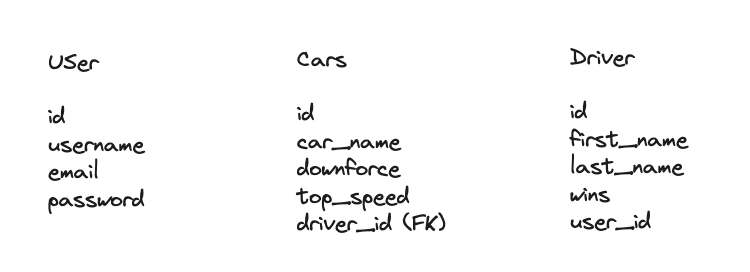

Race driver app Deployment
This was a solo project and I spent roughly two weeks on this.

# Technologies

Rails and Ruby and CSS

# Brief

This app is supposed to show custom race car drivers and their cars.

# Goals

# Technical requirement

Build a full stack web application. Must be your own work. Select a Project Idea of your own. Have at least 2 models (more if it makes sense) Auth is a requirement Have full CRUD on at least one of your models Be able to Add/Delete on any remaining models Have high quality code: Follow accepted naming conventions Consistent indentation Well-structured and readable code Semantic naming of variables, functions, CSS classes, etc. Short and clear functions that do one thing Efficient code - if you have your MVP, refactor DRY (Don't Repeat Yourself) code Use one of these technology stacks. You may choose which tech stack. Full-Stack Rails App Rails API with React Front-End Express API with React Front-End Be deployed on Heroku or similar platform Craft a README.md file that explains your app.

# Planning

# ERD 


# User stories

As a racing fan I want to be logged in. 

As a racing fan I want to be able to understand the driver and their cars. 

As a racing fan I want to be able to make a custom driver and car. 

As a racing fan I want to be able to edit d and delete drivers. 

As a racing fan I want to make a profile. 

As a running fan I want to be able to see other people's stuff. 

As a racing fan I would like to be able to make more than one driver. 

As a racing fan I want to be able to perform CRUD operations.

# Build process

Day 1:  I started with the wireframes, user stories and ERD using exaclidraw .

Day 2 : I made a cars and driver model using rails g model and then rendered the page using rails s but I ran into an issue, I couldn’t render the car model with the driver model.I deleted the models and remade them but with relationships and seeded it with DB seed. I then added “has_many :cars” so I could add lots of cars to one driver.

Day 3 : I successfully rendered some of the pages in Rails and tested by making a file called “index.html.erb” in the view directory under the app directory and rendered it.I implemented the CRU in CRUD for the driver model which was done with create, update, edit and destroy in the drivers controller. I also made other pages so I could implement the CRUD. 
```
 <tr class="tables">
        <th>Driver</th>
        <th>Lastname</th>
        <th>Wins</th>
        <th>Edit/Delete</th>
      </tr>

      <% @drivers.each do |driver| %>
        <tr>
          <td><%= link_to driver.first_name, driver_path(driver), class: "firstname" %></td>
          <td><%= driver.last_name %></td>
          <td><%= driver.wins %></td>
          <td>
            <%= link_to 'Edit', edit_driver_path(driver), class: "edit-btn" %>
            &nbsp;|&nbsp;
            <%= link_to 'Delete', driver_path(driver), data: { turbo_method: :delete, turbo_confirm: 'Are you sure you want to delete this driver?' }, class: "delete-btn" %>
          </td>
        </tr>
```


Day 4 : I completed the CRUD for the driver model and added some CRUD for the car model. Then I encountered some bugs while trying to delete some of the items, I discovered the problems were in the car controller and I fixed the problem which was dependent destroy was in the wrong place. 

Day 5 : I attempted the authentication but ultimately failed because I was unfamiliar with it. 

Day 6 : I rewatched some videos and implemented the authentication using devise and made the page force the authentication with “before_action :authenticate_user!
”. And made some accounts. Then I cleaned up the pages by adding some navigation by adding links.

 Day 7 : Only CSS. Which was adding a background picture and making the links look nicer and change colour when highlighted.

 ```
 .create-btn {
   display: inline-block;
   padding: 8px 16px;
   background-color: #007bff;
   color: #fff;
   text-decoration: none;
   border-radius: 4px;
 }
 
 .create-btn:hover {
   background-color: #0056b3;
 }
 ```

Day 8 : I added a bar and arranged the information to be properly display along with the buttons and I started the README.


 Day 9 : I finished the CSS and README and made the Code more DRY.

# Challenges

 The issue was that I didn’t generate them with relationships. I then deleted them and regenerated and  after that seeded my database using DB seed. 
The other challenge was the delete function for the driver model. The issue was that if the driver model had a car model attached to it would not delete. The reason for that was because I added the dependent destroy in  the wrong place so I added it to the driver model so the car and the driver model will be deleted.

# Wins

I got the authentication working and full CRUD working on the Driver model. And I got the pages working well and looking good.

# Bugs
Sometimes when deleting the app will not delete the driver. And sometimes the app only displays the drivers first name.
# Improvement
The CSS could be so much better and I could have added more content to the app. As well full CRUD to the cars as well (the car model can be created and read but can’t be updated or deleted without deleting the driver first ). The background picture I chose wasn’t that good and I could reposition the items and the page better. I could also make the landing / login page more in the centre instead of making it look like the default page..

# Key learning
Model view controller management, Database management, Active record and routing.
